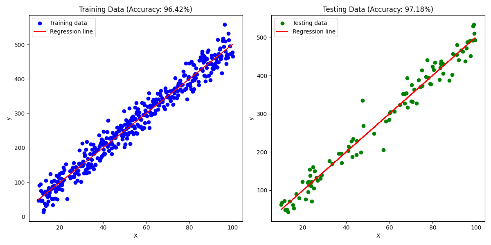
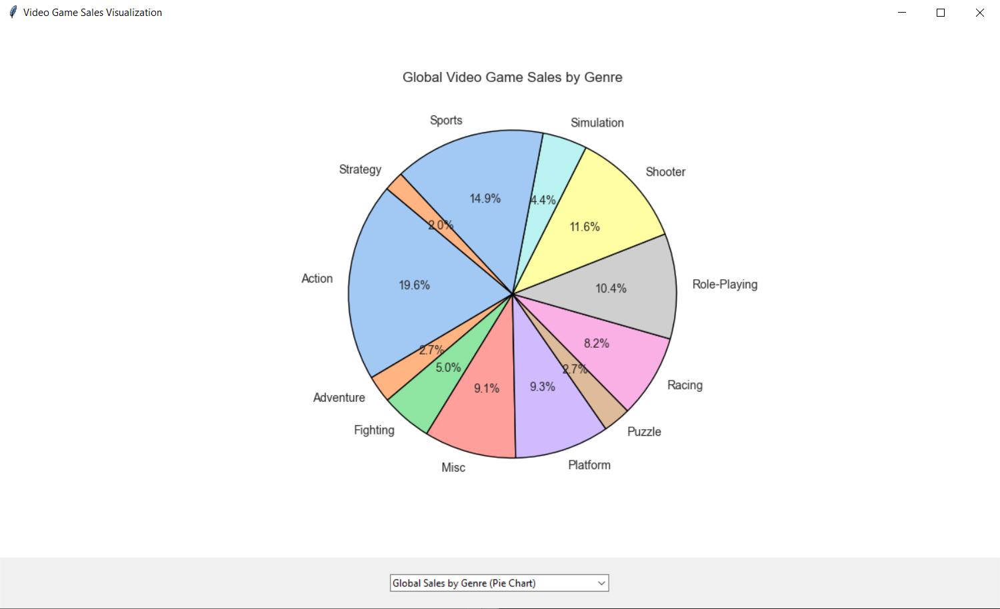

# Machine Learning Algorithms & Video Game Sales Data Visualization

## 📌 Overview
This repository contains implementations of various Machine Learning algorithms along with a visualization tool that provides insights into video game sales dataset. The visualization is represented through bar graphs, line graph and pie charts to analyze key trends effectively.

## 📂 Repository Contents
### 1️⃣ Machine Learning Algorithms
- Implementation of fundamental ML algorithms.
- Includes detailed explanations and well-commented code.
- Covers supervised and unsupervised learning techniques, such as :
    1. Simple and Multiple Linear Regression
    2. K-Means Clustering
    3. K-Nearest Neighbour
    4. Naive Bayes

### 2️⃣ Game Sales Data Visualization
- Uses bar graphs, line graph and pie charts for visual representation.
- Provides insights into sales performance across different platforms, genres, and regions.
- Helps in understanding market trends and key revenue sources.

## 🛠️ Technologies Used
- **Programming Language:** Python
- **Libraries:** NumPy, Pandas, Matplotlib, Seaborn, Scikit-learn

## 🚀 Getting Started
### *1️⃣ Clone the Repository*
- Open your terminal and run the following command:

   git clone https://github.com/yourusername/your-repo-name.git

### *2️⃣ Navigate to the Project Directory*
- Move into the project folder using:

    cd your-repo-name

### *3️⃣ Install Dependencies*
- Ensure you have all required libraries installed:

    pip install -r requirements.txt

### *5️⃣ Run the Machine Learning Scripts or Video Game Sales Visualization as needed*

## 📊 Example Visualizations
   

## 🤝 Contributing
- Contributions are welcome! Feel free to fork the repo, create a feature branch, and submit a pull request.

## *Maintained by @AbdulQader856*